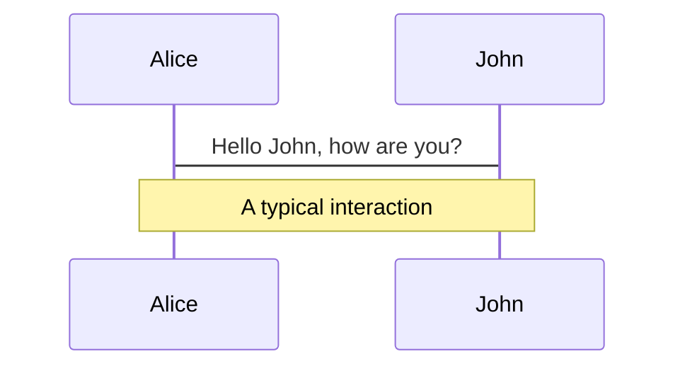
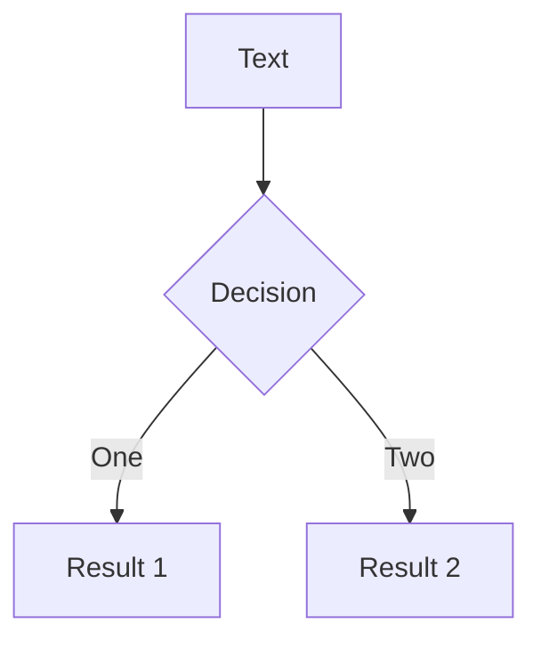
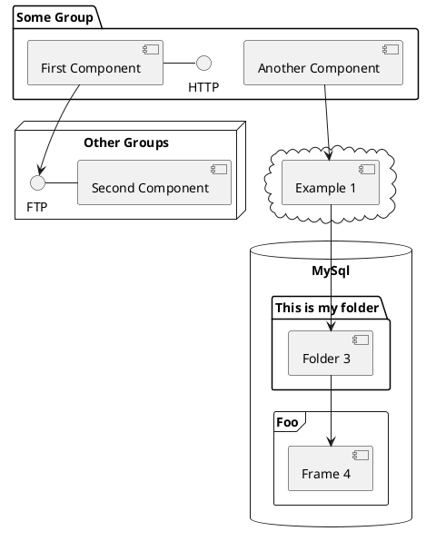

---
# try also 'default' to start simple
theme: seriph
# random image from a curated Unsplash collection by Anthony
# like them? see https://unsplash.com/collections/94734566/slidev
background: ./images/coedo_5th_01.jpg
# apply any windi css classes to the current slide
class: 'text-center'
# https://sli.dev/custom/highlighters.html
highlighter: shiki
# show line numbers in code blocks
lineNumbers: false
# some information about the slides, markdown enabled
info: |
  ## Slidev Starter Template
  Presentation slides for developers.

  Learn more at [Sli.dev](https://sli.dev)
# persist drawings in exports and build
drawings:
  persist: false
# use UnoCSS (experimental)
css: unocss
---

# Nuxt モジュールの作り方を知って<br>開発した機能を再利用しよう

田中弘治@Co-Edo

---
tit:e: About me
layout: image-right
image: ./images/kohji_vector_white.png
class: grid-col-3/4
---
# たなかこうじ @Co-Edo

Vue.js と Nuxt を愛するフロントエンドエンジニア

I ♥ TypeScript / JavaScript.

[コワーキングスペース茅場町 Co-Edo](https://www.coworking.tokyo.jp/) 運営代表者

[株式会社ダイレクトサーチジャパン](https://direct-search.jp./) 代表取締役

* GitHub [monsat](https://github.com/monsat)
* Twitter [ktanaka](https://twitter.com/ktanaka)
* Blog [kohji.blog](https://kohji.blog)

---
title: Today's Topic
layout: center
---

# Nuxt Module

<style>
h1 {
  font-size: 6em;
}
</style>

---
---

# Vue.js, Nuxt, プラグイン, モジュール

* Vue.js
  * クールな JavaScript フレームワーク
* Nuxt
  * クールな Web アプリケーション（メタ）フレームワーク

## プラグインとモジュール

* Vue.js プラグイン
  * Vue.js のアプリケーションを拡張する
* Nuxt プラグイン
  * ランタイムに動作し Nuxt アプリケーションを拡張する
* Nuxt モジュール
  * Nuxt 起動時に動作し、アプリケーションや Nuxt 自体を拡張する
  * ビルドタイムとランタイムのどちらも拡張可能

---
---

# なぜ Nuxt モジュール ?

## 複数のプロジェクト間で使用可能

共通の設定やコンポーネント等の使用が可能

## Nuxt 自体の拡張が可能

Nuxt は高機能な一方で、コアはとてもシンプルに作られている

## ビルドタイムの動作を拡張可能

例）外部ファイルを読み込んでコンテンツに加えたい

## プラグイン自体を拡張可能

例）プラグインのインストール前に何らかの処理をしたい


---
layout: center
---

# Nuxt モジュールの使い方

---
---

# `nuxt.config.ts` に記述するのみ

```ts {all|5}
// nuxt.config.ts

import { defineNuxtConfig } from 'nuxt'
import BasicAuth from 'nuxt-basic-authentication-module'

export default defineNuxtConfig({
  modules: [
    '@nuxtjs/example', // npm のパッケージ名で記述
    './modules/example', // プロジェクト内のローカルモジュール
    ['./modules/example', { token: '123' }], // オプションを指定する場合
    BasicAuth, // これも可

    // インラインで記述することもできる
    async (inlineOptions, nuxt) => { },
  ]
})
```

---
layout: center
---

# モジュール開発、最初の一歩

---
---

# モジュールの開発 → コードやロジックの再利用

どのプロジェクトでも同じような設定で Vue プラグインを読み込む場合

毎回似たような認証のロジックを書いている場合

いつも使用する `ref()` や `computed()` がある場合

汎用的に使えるコンポーネントを作成済の場合

## モジュールにしておくと使い回しやすい

たとえば

* Plugins の再利用
* Composables の再利用
* Components 等 の再利用
* ぜんぶ組み合わせて再利用

---
---

# Nuxt モジュールの正体

開発モードでの起動 (`nuxi dev`) 時や  
本番用のビルド (`nuxi build`, `nuxi generate`) 時に実行される  
**非同期関数**

```ts {all|7-9}
// modules/module.ts

export default async (inlineOptions, nuxt) => {
  console.log(inlineOptions.foo) // `bar`
  console.log(nuxt.options.dev) // true or false

  nuxt.hook('ready', async nuxt => {
    console.log('Nuxt is ready')
  })
}
```

<v-click>

`nuxt.hook()` で、特定のタイミングをフックできる

</v-click>

---
layout: center
---

# **Nuxt Kit** が神！

---
---

# Nuxt Kit

ビルドやランタイムのフックや、コアの機能を活用するためのユーティリティ  
**Nuxt モジュールの作成がとても効率的に！**

<div class="grid grid-cols-2 text-[0.88em]">
<div>

* Compatibility
  * `checkNuxtCompatibility(constraints)`
  * `assertNuxtCompatibility(constraints)`
  * `hasNuxtCompatibility(constraints)`
  * `isNuxt2()`, `isNuxt3()`, `getNuxtVersion()`
* Components
  * `addComponentsDir(dir)`
  * `addComponent(componentObject)`
* Plugins, Templates
  * `addPlugin(pluginOptions, { append? })`
  * `addPluginTemplate(pluginOptions, { append? })`
  * `addTemplate(templateOptions)`

</div>
<div>

* Server
  * `addServerHandler (handler)`
  * `addDevServerHandler (handler)`
* Logging, Resolving
  * `useLogger(scope?)`
  * `resolvePath (path, resolveOptions?)`
  * `resolveAlias (path, aliases?)`
  * `findPath (paths, resolveOptions?)`
  * `createResolver (base)`
* Builder
  * `extendViteConfig(callback, options?)`
  * `addVitePlugin(vitePlugin, options?)`
  * `extendWebpackConfig(callback, options?)`

</div>
</div>

---
---

# ビルドやランタイムの特定の機能をフックする

* Nuxt Hooks
* App Hooks


---
---

# App Hooks

```ts
export interface RuntimeNuxtHooks {
  'app:created': (app: App<Element>) => HookResult
  'app:beforeMount': (app: App<Element>) => HookResult
  'app:mounted': (app: App<Element>) => HookResult
  'app:rendered': (ctx: AppRenderedContext) => HookResult
  'app:redirected': () => HookResult
  'app:suspense:resolve': (Component?: VNode) => HookResult
  'app:error': (err: any) => HookResult
  'app:error:cleared': (options: { redirect?: string }) => HookResult
  'app:data:refresh': (keys?: string[]) => HookResult
  // Page
  'page:start': (Component?: VNode) => HookResult
  'page:finish': (Component?: VNode) => HookResult
  // Vue.js
  'vue:setup': () => void
  'vue:error': (...args: Parameters<Parameters<typeof onErrorCaptured>[0]>) => HookResult
}
```

---
---

# Nuxt Hooks

たくさんあるので[ソースコード](https://github.com/nuxt/framework/blob/main/packages/schema/src/types/hooks.ts#L68)で確認しましょう

```ts
export interface NuxtHooks {
  // Kit
  'kit:compatibility': (compatibility: NuxtCompatibility, issues: NuxtCompatibilityIssues) => HookResult

  // nuxt
  'app:resolve': (app: NuxtApp) => HookResult
  'app:templates': (app: NuxtApp) => HookResult
  'app:templatesGenerated': (app: NuxtApp) => HookResult
  'builder:generateApp': () => HookResult
  'pages:extend': (pages: NuxtPage[]) => HookResult
  'build:manifest': (manifest: Manifest) => HookResult

  // Auto imports
  'imports:sources': (presets: ImportPresetWithDeprecation[]) => HookResult
  'imports:extend': (imports: Import[]) => HookResult
  'imports:dirs': (dirs: string[]) => HookResult

  /** @deprecated Please use `imports:sources` hook */
  'autoImports:sources': (presets: ImportPresetWithDeprecation[]) => HookResult
  /** @deprecated Please use `imports:extend` hook */
  'autoImports:extend': (imports: Import[]) => HookResult
  /** @deprecated Please use `imports:dirs` hook */
  'autoImports:dirs': (dirs: string[]) => HookResult

  // Components
  'components:dirs': (dirs: ComponentsOptions['dirs']) => HookResult
  'components:extend': (components: Component[]) => HookResult

  // @nuxt/builder
  'build:before':
  (builder: Builder, buildOptions: NuxtOptions['build']) => HookResult
  'builder:prepared': (builder: Builder, buildOptions: NuxtOptions['build']) => HookResult
  'builder:extendPlugins': (plugins: NuxtOptions['plugins']) => HookResult
  'build:templates': (templates: {
    templateVars: Record<string, any>,
    templatesFiles: NuxtTemplate[],
    resolve: (...args: string[]) => string
  }) => HookResult
  'build:extendRoutes': (routes: any[], resolve: (...args: string[]) => string) => HookResult
  'build:done': (builder: Builder) => HookResult
  'watch:restart': (event: { event: string, path: string }) => HookResult
  // 'watch:fileChanged': (builder: Builder, fileName: string) => HookResult
  'builder:watch': (event: WatchEvent, path: string) => HookResult

  // nitropack
  'nitro:config': (nitroConfig: NitroConfig) => HookResult
  'nitro:init': (nitro: Nitro) => HookResult
  'nitro:build:before': (nitro: Nitro) => HookResult

  // @nuxt/cli
  'generate:cache:ignore': (ignore: string[]) => HookResult
  'config': (options: NuxtConfig) => HookResult
  'run:before': (options: { argv: string[], cmd: { name: string, usage: string, description: string, options: Record<string, any> }, rootDir: string }) => HookResult

  // nuxi
  'build:error': (error: Error) => HookResult
  'prepare:types': (options: { references: TSReference[], declarations: string[], tsConfig: TSConfig }) => HookResult

  // @nuxt/core
  'ready': (nuxt: Nuxt) => HookResult
  'close': (nuxt: Nuxt) => HookResult
  'modules:before': (moduleContainer: ModuleContainer, modules?: any[]) => HookResult
  'modules:done': (moduleContainer: ModuleContainer) => HookResult
  // 'webpack:done': () => HookResult

  // @nuxt/server
  'render:before': (server: Server, renderOptions: NuxtOptions['render']) => HookResult
  'render:setupMiddleware': (app: any) => HookResult
  'render:errorMiddleware': (app: any) => HookResult
  'render:done': (server: Server) => HookResult
  'listen': (listenerServer: HttpServer | HttpsServer, listener: any) => HookResult
  'server:nuxt:renderLoading': (req: IncomingMessage, res: ServerResponse) => HookResult
  'render:route': (url: string, result: RenderResult, context: any) => HookResult
  'render:routeDone': (url: string, result: RenderResult, context: any) => HookResult
  'render:beforeResponse': (url: string, result: RenderResult, context: any) => HookResult

  // @nuxt/vue-renderer
  'render:resourcesLoaded': (resources: any) => HookResult
  'vue-renderer:context': (renderContext: any) => HookResult
  'vue-renderer:spa:prepareContext': (renderContext: any) => HookResult
  'vue-renderer:spa:templateParams': (templateParams: Record<string, any>) => HookResult
  'vue-renderer:ssr:prepareContext': (renderContext: any) => HookResult
  'vue-renderer:ssr:context': (renderContext: any) => HookResult
  // '_render:context': (nuxt: Nuxt) => HookResult
  // 'render:routeContext': (renderContext: any) => HookResult
  'vue-renderer:ssr:csp': (cspScriptSrcHashes: string[]) => HookResult
  'vue-renderer:ssr:templateParams': (templateParams: Record<string, any>, renderContext: any) => HookResult

  // @nuxt/webpack
  'webpack:config': (webpackConfigs: Configuration[]) => HookResult
  'webpack:devMiddleware': (middleware: (req: IncomingMessage, res: ServerResponse, next: (err?: any) => any) => any) => HookResult
  'webpack:hotMiddleware': (middleware: (req: IncomingMessage, res: ServerResponse, next: (err?: any) => any) => any) => HookResult
  'build:compile': (options: { name: string, compiler: Compiler }) => HookResult
  'build:compiled': (options: { name: string, compiler: Compiler, stats: Stats }) => HookResult
  'build:resources': (mfs?: Compiler['outputFileSystem']) => HookResult
  'server:devMiddleware': (middleware: Middleware) => HookResult
  'bundler:change': (shortPath: string) => void
  'bundler:error': () => void
  'bundler:done': () => void
  'bundler:progress': (statesArray: any[]) => void

  // @nuxt/generator
  'generate:before': (generator: Generator, generateOptions: NuxtOptions['generate']) => HookResult
  'generate:distRemoved': (generator: Generator) => HookResult
  'generate:distCopied': (generator: Generator) => HookResult
  'generate:route': ({ route, setPayload }: { route: any, setPayload: any }) => HookResult
  'generate:page': (page: {
    route: any,
    path: string,
    html: string,
    exclude: boolean,
    errors: string[]
  }) => HookResult
  'generate:routeCreated': ({ route, path, errors }: { route: any, path: string, errors: any[] }) => HookResult
  'generate:extendRoutes': (routes: any[]) => HookResult
  'generate:routeFailed': ({ route, errors }: { route: any, errors: any[] }) => HookResult
  'generate:manifest': (manifest: any, generator: Generator) => HookResult
  'generate:done': (generator: Generator, errors: any[]) => HookResult

  'export:before': (generator: Generator) => HookResult
  'export:distRemoved': (generator: Generator) => HookResult
  'export:distCopied': (generator: Generator) => HookResult
  'export:route': ({ route, setPayload }: { route: any, setPayload: any }) => HookResult
  'export:routeCreated': ({ route, path, errors }: { route: any, path: string, errors: any[] }) => HookResult
  'export:extendRoutes': ({ routes }: { routes: any[] }) => HookResult
  'export:routeFailed': ({ route, errors }: { route: any, errors: any[] }) => HookResult
  'export:done': (generator: Generator, { errors }: { errors: any[] }) => HookResult

  // vite
  'vite:extend': (viteBuildContext: { nuxt: Nuxt, config: ViteInlineConfig }) => HookResult
  'vite:extendConfig': (viteInlineConfig: ViteInlineConfig, env: { isClient: boolean, isServer: boolean }) => HookResult
  'vite:serverCreated': (viteServer: ViteDevServer, env: { isClient: boolean, isServer: boolean }) => HookResult
}
```

---
layout: center
---

# 実践てきなモジュール開発例

---
layout: center
---

# ある日、上司から

---
layout: talk-left
image: ./images/business_man1_1_smile.png
---

# サブスク解約機能の実装ありがとう
## 追加でお願いしたいんだけど…

---
layout: talk-right
image: ./images/face_smile_man1.png
---

# （嫌な予感…）
## はい、なんでしょうか？

---
layout: talk-left
image: ./images/business_man1_1_smile.png
---

# 誤クリックで解約できてしまうので
## 「確認画面」を挟んでほしい

---
layout: talk-right
image: ./images/face_smile_man1.png
---

# （ほっ…）
## 分かりました。他のプロジェクト用に
## Nuxt モジュールにしておきますね

---
layout: talk-right
image: ./images/face_smile_man1.png
---

# **VueUse** に確か…
## `useConfirmDialog` というのがあった

---
layout: talk-right
image: ./images/face_smile_man1.png
---

# `useConfirmDialog` を使って…
## できた！
---
---

# 確認画面コンポーネント

（本題ではありませんが）コンポーネントを作成します。

## 

```html
<script setup lang="ts">
import { useConfirmDialog } from '@vueuse/core'
const { isRevealed, reveal, confirm, cancel, onReveal, onConfirm, onCancel } = useConfirmDialog()
</script>

<template>
  <button @click="reveal">サブスクを解約する</button>

  <dialog :open="isRevealed">
    <h2>解約しますか？</h2>
    <div>
      <button @click="cancel">いいえ</button>
      <button @click="confirm">はい</button>
    </div>
  </dialog>
</template>
```
---
layout: talk-right
image: ./images/face_smile_man1.png
---

# Nuxt モジュールにするために
## 外側から呼び出しやすいようにしよう

---
---

# 確認画面コンポーネント

（モジュールにした際、利用しやすいように）コンポーネントを変更します。

## 

```html
<script setup lang="ts">
type Emits = {
  (e: 'confirm', result: boolean): void
  (e: 'cancel'): void
}
const emit = defineEmits<Emits>()
const { isRevealed, reveal, confirm, cancel, onReveal, onConfirm, onCancel } = useConfirmDialog()
onConfirm(() => emit('confirm', true))
onCancel(() => emit('cancel'))
</script>

<template>
  <button v-bind="$attrs" @click="reveal">
    <slot />
  </button>
  <dialog :open="isRevealed">
    <h2>解約しますか？</h2>
    <div>
      <button @click="cancel">いいえ</button>
      <button @click="confirm">はい</button>
    </div>
  </dialog>
</template>
```

---
---

# 確認画面コンポーネントの呼び出し方

Page コンポーネント等、呼び出し側で任意の処理ができるようになりました

```html
<script setup lang="ts">
// Page Component
const completeCancel = (result: boolean) => {
  console.log('解約完了', result)
}
const canceled = () => {
  console.log('キャンセルされました')
}
</script>

<template>
  <div>
    <CancelConfirm
      @confirm="completeCancel"
      @cancel="canceled"
    />
      サブスクを解約する
    </CancelConfirm>
  </div>
</template>
```

---
layout: talk-right
image: ./images/face_smile_man1.png
---

# モジュールにするには<br>何から始めればいいのだろう？
## お。なんか便利そうなのがあった

---
---

# Nuxt モジュール開発の始め方

便利なコマンドが用意されています。

```bash
$ npx nuxi init -t module nuxt-your-module-name
```

次のようなフォルダ構成の環境ができます。

<div class="pa-2 bg-dark-600">

* 　<TreeFolder> src</TreeFolder> ・・・モジュールを格納するディレクトリ
  * 　<cib-typescript /> module.ts
  * 　<TreeFolder> runtime</TreeFolder>
    * <cib-typescript /> plugin.ts
* 　<TreeFolder> playground</TreeFolder> ・・・動作確認用 Nuxt アプリケーション
  * 　<ph-file-vue-fill /> app.vue
  * <cib-typescript /> nuxt.config.ts
* 　<lucide-file-json-2 /> package.json

</div>

---
layout: talk-right
image: ./images/face_smile_man1.png
---

# `src` ディレクトリで開発し
## `yarn dev` すると `playground` 以下の Nuxt アプリで動作確認できるのね

---
---

# `playground/nuxt.config.ts` の中身

```ts
import { defineNuxtConfig } from 'nuxt'
import MyModule from '..'

export default defineNuxtConfig({
  modules: [
    MyModule
  ],
  myModule: {
    addPlugin: true
  }
})
```

<v-click>

2行目で開発中のモジュールを読み込んでいる

```ts
import MyModule from '..' // ← 上位のフォルダを読むように設定されている
```

開発しやすい！

</v-click>

---
clicks: 4
---

# `src/module.ts` の中身

```ts {all|14-16|17|5}
import { resolve } from 'path'
import { fileURLToPath } from 'url'
import { defineNuxtModule, addPlugin } from '@nuxt/kit'

export interface ModuleOptions {
  addPlugin: boolean
}

export default defineNuxtModule<ModuleOptions>({
  meta: {
    name: 'my-module',
    configKey: 'myModule' // nuxt.config.ts で使用可能な key
  },
  defaults: {
    addPlugin: true
  },
  setup (options, nuxt) {
    if (options.addPlugin) {
      const runtimeDir = fileURLToPath(new URL('./runtime', import.meta.url))
      nuxt.options.build.transpile.push(runtimeDir)
      addPlugin(resolve(runtimeDir, 'plugin'))
    }
  }
})
```

<div v-if="$slidev.nav.clicks >= 1">

<div v-click>1</div>
<div v-click>

## options

defaults の内容を nuxt.options[configKey] で上書き
inlineOptions があれば inlineOptions で上書き（最優先）

</div>
<div v-click>

## defineNuxtModule

オプションを適宜マージし、hooks 等を addHooks しつつ setup() を実行し、NuxtModule を返す

</div>

</div>

---
layout: talk-right
image: ./images/face_smile_man1.png
---

# `src/runtime/components` に `CancelConfirm.vue` を保存して


## `src/module.ts` を変更しよう

---
---

# Nuxt モジュールでコンポーネントを読み込む

`src/runtime/components` フォルダに `CancelConfirm.vue` を保存し `src/module.ts` を変更

```ts
import { resolve } from 'path'
import { fileURLToPath } from 'url'
import { defineNuxtModule, addPlugin } from '@nuxt/kit'
export interface ModuleOptions {
  prefix?: string
}
export default defineNuxtModule<ModuleOptions>({
  meta: {
    name: 'coedo-cancel-confirm',
    configKey: 'coedoCancelConfirm'
  },
  defaults: {
    prefix: 'coedo'
  },
  setup (options, nuxt) {
    const { resolve } = createResolver(import.meta.url)
    await addComponentsDir({
      path: resolve('./runtime/components'),
      prefix: options.prefix,
      global: true
    })
  }
})
```

---
---

# 動作確認

`playground/app.vue` で（Prefix をつけて）コンポーネントを読み込む

```html
<script setup lang="ts">
// Page Component
const completeCancel = (result: boolean) => {
  console.log('解約完了', result)
}
const canceled = () => {
  console.log('キャンセルされました')
}
</script>

<template>
  <div>
    <h1>解約確認モジュール</h1>
    <CoedoCancelConfirm
      @confirm="completeCancel"
      @cancel="canceled"
    />
      サブスクを解約する
    </CancelConfirm>
  </div>
</template>
```

---
layout: talk-right
image: ./images/face_smile_man1.png
---

# できた 🎉
## 意外と簡単だった

---
layout: center
---

# しかし

---
layout: talk-left
image: ./images/business_man1_1_smile.png
---

# ついでに「解約が減るように」して
## ほら、最近うえから「解約を減らせ」ってうるさく言われてて。できるよね？

---
layout: talk-right
image: ./images/face_smile_man1.png
---

# （分かりました。実装します）
## やれやれ、こういうこと言う上司の下では働きたくないな。依頼もふわっとしてるし

---
layout: center
---

# そして


---
layout: talk-right
image: ./images/face_smile_man1.png
---

# できた
## 動作確認するか

---
---

# 作ったもの

@TODO: 動画を挿入

---
---
# Welcome to Slidev

Presentation slides for developers

<div class="pt-12">
  <span @click="$slidev.nav.next" class="px-2 py-1 rounded cursor-pointer" hover="bg-white bg-opacity-10">
    Press Space for next page <carbon:arrow-right class="inline"/>
  </span>
</div>

<div class="abs-br m-6 flex gap-2">
  <button @click="$slidev.nav.openInEditor()" title="Open in Editor" class="text-xl icon-btn opacity-50 !border-none !hover:text-white">
    <carbon:edit />
  </button>
  <a href="https://github.com/slidevjs/slidev" target="_blank" alt="GitHub"
    class="text-xl icon-btn opacity-50 !border-none !hover:text-white">
    <carbon-logo-github />
  </a>
</div>

テスト23
<!--
The last comment block of each slide will be treated as slide notes. It will be visible and editable in Presenter Mode along with the slide. [Read more in the docs](https://sli.dev/guide/syntax.html#notes)

テストコメント
-->

---

# What is Slidev?

Slidev is a slides maker and presenter designed for developers, consist of the following features

- 📝 **Text-based** - focus on the content with Markdown, and then style them later
- 🎨 **Themable** - theme can be shared and used with npm packages
- 🧑‍💻 **Developer Friendly** - code highlighting, live coding with autocompletion
- 🤹 **Interactive** - embedding Vue components to enhance your expressions
- 🎥 **Recording** - built-in recording and camera view
- 📤 **Portable** - export into PDF, PNGs, or even a hostable SPA
- 🛠 **Hackable** - anything possible on a webpage

<br>
<br>

Read more about [Why Slidev?](https://sli.dev/guide/why)

<!--
You can have `style` tag in markdown to override the style for the current page.
Learn more: https://sli.dev/guide/syntax#embedded-styles
-->

<style>
h1 {
  background-color: #2B90B6;
  background-image: linear-gradient(45deg, #4EC5D4 10%, #146b8c 20%);
  background-size: 100%;
  -webkit-background-clip: text;
  -moz-background-clip: text;
  -webkit-text-fill-color: transparent;
  -moz-text-fill-color: transparent;
}
</style>

---

# Navigation

Hover on the bottom-left corner to see the navigation's controls panel, [learn more](https://sli.dev/guide/navigation.html)

### Keyboard Shortcuts

|     |     |
| --- | --- |
| <kbd>right</kbd> / <kbd>space</kbd>| next animation or slide |
| <kbd>left</kbd>  / <kbd>shift</kbd><kbd>space</kbd> | previous animation or slide |
| <kbd>up</kbd> | previous slide |
| <kbd>down</kbd> | next slide |

<!-- https://sli.dev/guide/animations.html#click-animations -->

<p v-after class="absolute bottom-23 left-45 opacity-30 transform -rotate-10">Here!</p>

---
layout: image-right
image: https://source.unsplash.com/collection/94734566/1920x1080
---

# Code

Use code snippets and get the highlighting directly![^1]

```ts {all|2|1-6|9|all}
interface User {
  id: number
  firstName: string
  lastName: string
  role: string
}

function updateUser(id: number, update: User) {
  const user = getUser(id)
  const newUser = { ...user, ...update }
  saveUser(id, newUser)
}
```

<arrow v-click="3" x1="400" y1="420" x2="230" y2="330" color="#564" width="3" arrowSize="1" />

[^1]: [Learn More](https://sli.dev/guide/syntax.html#line-highlighting)

<style>
.footnotes-sep {
  @apply mt-20 opacity-10;
}
.footnotes {
  @apply text-sm opacity-75;
}
.footnote-backref {
  display: none;
}
</style>

---

# Components

<div grid="~ cols-2 gap-4">
<div>

You can use Vue components directly inside your slides.

We have provided a few built-in components like `<Tweet/>` and `<Youtube/>` that you can use directly. And adding your custom components is also super easy.

```html
<Counter :count="10" />
```

<!-- ./components/Counter.vue -->
<Counter :count="10" m="t-4" />

Check out [the guides](https://sli.dev/builtin/components.html) for more.

</div>
<div>

```html
<Tweet id="1390115482657726468" />
```

<Tweet id="1390115482657726468" scale="0.65" />

</div>
</div>


---
class: px-20
---

# Themes

Slidev comes with powerful theming support. Themes can provide styles, layouts, components, or even configurations for tools. Switching between themes by just **one edit** in your frontmatter:

<div grid="~ cols-2 gap-2" m="-t-2">

```yaml
---
theme: default
---
```

```yaml
---
theme: seriph
---
```


</div>

Read more about [How to use a theme](https://sli.dev/themes/use.html) and
check out the [Awesome Themes Gallery](https://sli.dev/themes/gallery.html).

---
preload: false
---

# Animations

Animations are powered by [@vueuse/motion](https://motion.vueuse.org/).

```html
<div
  v-motion
  :initial="{ x: -80 }"
  :enter="{ x: 0 }">
  Slidev
</div>
```

<div class="w-60 relative mt-6">
  <div class="relative w-40 h-40">
    
    
    
  </div>

  <div
    class="text-5xl absolute top-14 left-40 text-[#2B90B6] -z-1"
    v-motion
    :initial="{ x: -80, opacity: 0}"
    :enter="{ x: 0, opacity: 1, transition: { delay: 2000, duration: 1000 } }">
    Slidev
  </div>
</div>

<!-- vue script setup scripts can be directly used in markdown, and will only affects current page -->
<script setup lang="ts">
const final = {
  x: 0,
  y: 0,
  rotate: 0,
  scale: 1,
  transition: {
    type: 'spring',
    damping: 10,
    stiffness: 20,
    mass: 2
  }
}
</script>

<div
  v-motion
  :initial="{ x:35, y: 40, opacity: 0}"
  :enter="{ y: 0, opacity: 1, transition: { delay: 3500 } }">

[Learn More](https://sli.dev/guide/animations.html#motion)

</div>

---

# LaTeX

LaTeX is supported out-of-box powered by [KaTeX](https://katex.org/).

<br>

Inline $\sqrt{3x-1}+(1+x)^2$

Block
$$
\begin{array}{c}

\nabla \times \vec{\mathbf{B}} -\, \frac1c\, \frac{\partial\vec{\mathbf{E}}}{\partial t} &
= \frac{4\pi}{c}\vec{\mathbf{j}}    \nabla \cdot \vec{\mathbf{E}} & = 4 \pi \rho \\

\nabla \times \vec{\mathbf{E}}\, +\, \frac1c\, \frac{\partial\vec{\mathbf{B}}}{\partial t} & = \vec{\mathbf{0}} \\

\nabla \cdot \vec{\mathbf{B}} & = 0

\end{array}
$$

<br>

[Learn more](https://sli.dev/guide/syntax#latex)

---

# Diagrams

You can create diagrams / graphs from textual descriptions, directly in your Markdown.

<div class="grid grid-cols-3 gap-10 pt-4 -mb-6">







</div>

[Learn More](https://sli.dev/guide/syntax.html#diagrams)


---
layout: center
class: text-center
---

# Learn More

[Documentations](https://sli.dev) · [GitHub](https://github.com/slidevjs/slidev) · [Showcases](https://sli.dev/showcases.html)
